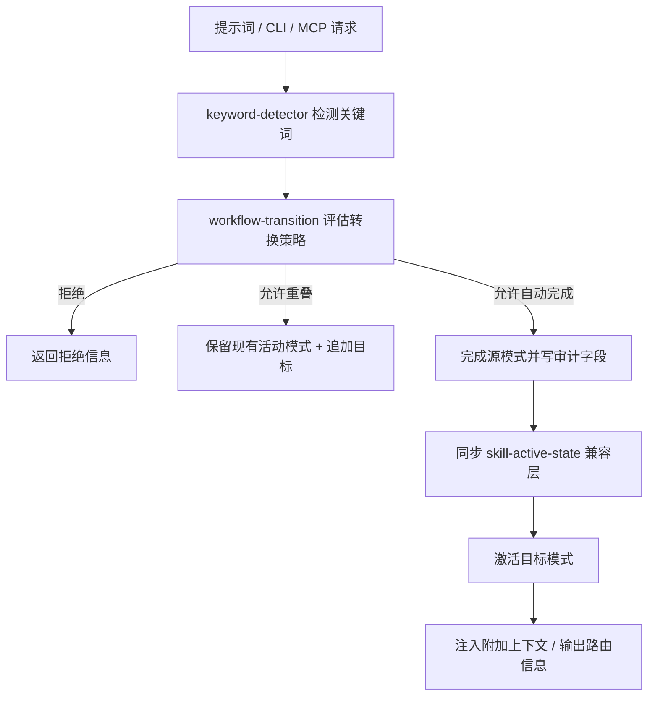

# oh-my-codex (OMX) 源码级机制参考文档

> 适用版本：oh-my-codex **v0.20.5**（npm 包 `oh-my-codex`）
> 仓库：https://github.com/Yeachan-Heo/oh-my-codex （官方唯一发布线）
> 源码引用约定：所有 `文件:行号` 或 `函数名` 均指向克隆仓库 `C:\Users\alphazz\AppData\Local\Temp\opencode\repos\oh-my-codex` 中真实存在的文件；行号以克隆时刻的 HEAD 为准。
> 本仓库为 **OpenAI Codex CLI 的工作流层（workflow layer）**，不替换 Codex；下文「原生宿主」指 Codex CLI，「OpenCode 适配」指迁移到 OpenCode 时的注意事项。

---

## 1. 概览

OMX 是一个架设在 [OpenAI Codex CLI](https://github.com/openai/codex) 之上的多智能体编排层。它不自己执行 agent 工作，而是提供：

- **更强的默认启动**：`omx --worktree=feat/task --madmax --xhigh` 一键把 Codex 启动成「强会话 + 独立 git worktree + 免审批沙箱 + 高推理档位」；
- **一致的工作流**：从澄清（`$deep-interview`）→ 计划共识（`$ralplan`）→ 持久化执行（`$ultragoal` / `$ultrawork` / `$ralph` / `$team`）的完整闭环；
- **可复用的角色与技能**：30+ 原生 agent 定义 + 40+ SKILL.md 技能；
- **持久的工程状态**：`.omx/` 目录存放计划、日志、记忆与模式状态。

核心心智模型（README.md:295-305）：**Codex 干活，OMX 提供更好的任务路由 + 更好的工作流 + 更好的运行时**。所有状态统一放在仓库内 `.omx/`（README.md:38），所有模式状态、HUD、MCP、hooks 共享同一套状态模型（docs/STATE_MODEL.md:1-3）。

推荐默认流程（README.md:318-326）：
1. `$deep-interview` 澄清范围 → 2. `$ralplan` 产出并批准架构与实施计划 → 3. `$ultragoal` 把批准的计划固化为带 `.omx/ultragoal` 账本的持久化多目标执行。

---

## 2. 机制清单表

| # | 机制 | 类别 | 入口 | 主要源码 |
|---|---|---|---|---|
| 1 | `omx` CLI 入口与命令分发 | 运行时 | `omx <command>` | `src/cli/omx.ts`、`src/cli/index.ts:3333` |
| 2 | 启动器（launch/worktree/madmax/HUD） | 运行时 | `omx --worktree=… --madmax --xhigh` | `src/cli/index.ts:3866`、`src/cli/index.ts:4216` |
| 3 | `omx exec` / `omx mission` | 执行 | `omx exec "…"`、`omx mission ./m.md` | `src/cli/index.ts:4081`、`src/cli/mission.ts:361` |
| 4 | `omx setup` / `omx doctor` / `omx update` / `omx uninstall` | 运维 | `omx setup --scope project` 等 | `src/cli/setup.ts:3856`、`src/cli/doctor.ts:544` |
| 5 | 规划类关键词 | 技能层 | `$deep-interview`、`$ralplan`、`$plan`、`$prometheus-strict` | `skills/deep-interview/SKILL.md`、`skills/ralplan/SKILL.md` |
| 6 | 研究边界关键词 | 技能层 | `$best-practice-research`、`$autoresearch`、`$autoresearch-goal` | `skills/best-practice-research/`、`src/autoresearch/` |
| 7 | 执行模式 | 技能层+运行时 | `$autopilot`、`$ultrawork`、`$ultragoal`、`$ralph`、`$team`、`$ultraqa` | `src/modes/base.ts`、`src/team/`、`src/ralph/`、`src/ultragoal/` |
| 8 | 角色/Agent 系统 | 技能层 | `$architect`、`$executor`、`explore` 等 30+ | `src/agents/definitions.ts:52`、`prompts/*.md` |
| 9 | 技能系统（SKILL.md + 目录清单） | 技能层 | `/skills`、`$name` | `src/catalog/manifest.json`、`src/catalog/installable.ts` |
| 10 | 关键词检测与状态机 | 运行时 | 提示词触发 | `src/hooks/keyword-registry.ts:8`、`src/hooks/keyword-detector.ts` |
| 11 | Hooks 系统（原生 Codex + 回退 + 插件） | 运行时 | `.codex/hooks.json`、`.omx/hooks/*.mjs` | `src/scripts/codex-native-hook.ts`、`src/hooks/extensibility/` |
| 12 | HUD | 运行时 | `omx hud --watch` | `src/hud/index.ts:331`、`src/hud/tmux.ts:1408` |
| 13 | 记忆与状态（.omx/state、project-memory、notepad） | 状态 | `omx state …`、MCP 工具 | `src/modes/base.ts`、`src/mcp/state-server.ts` |
| 14 | 通知系统（Discord/Telegram/Slack/OpenClaw） | 集成 | `.omx-config.json` + hooks 事件 | `src/notifications/`、`src/openclaw/` |
| 15 | MCP 服务器（state/memory/code-intel/trace/wiki/hermes） | 集成 | `omx mcp-serve <name>` | `src/cli/mcp-serve.ts:69`、`src/mcp/` |
| 16 | Codex 插件（plugin bundle + marketplace） | 集成 | `plugins/oh-my-codex/` | `plugins/oh-my-codex/.codex-plugin/plugin.json` |
| 17 | 配置系统（.omx-config.json 模型/环境路由） | 配置 | `~/.codex/.omx-config.json` | `src/config/models.ts`、`docs/reference/omx-config-schema-routing.md` |
| 18 | Wiki | 集成 | `omx wiki …` | `src/wiki/`、`docs/wiki-feature.md` |
| 19 | Sparkshell / 原生 Rust 侧车 | 工具 | `omx sparkshell <cmd>` | `src/cli/sparkshell.ts:406`、`crates/omx-sparkshell/` |
| 20 | Team 运行时（tmux + worktree + 邮箱） | 执行 | `omx team 3:executor "…"` | `src/cli/team.ts:1401`、`src/team/runtime.ts` |
| 21 | Ultragoal（持久化多目标 + Codex goal 握手） | 执行 | `omx ultragoal …` | `src/cli/ultragoal.ts:362`、`src/ultragoal/artifacts.ts` |
| 22 | Ralph（持久化完成循环） | 执行 | `omx ralph` / `$ralph` | `src/cli/ralph.ts:299`、`src/ralph/` |
| 23 | Auth 热切换 / Sidecar / Imagegen 续跑 | 工具 | `omx auth`、`omx sidecar`、`omx imagegen` | `src/auth/hotswap.ts`、`src/sidecar/`、`src/imagegen/continuation.ts` |

---

## 3. 各机制详解

### 3.1 `omx` CLI 入口与命令分发

**能力说明**：全局 CLI `omx`，负责启动 Codex、安装/诊断、团队编排、状态管理、通知等全部运行时能力。npm bin 映射为 `omx`（package.json:7-9）。入口 `src/cli/omx.ts:1-29` 只做一件事：定位 `dist/cli/index.js` 并调用其 `main(argv)`；`src/cli/index.ts:3333` 的 `main()` 用 `knownCommands` 集合 + `switch` 分发到 40+ 子命令。

**用法（原生宿主 Codex CLI）**：
```bash
omx                      # 标准启动（带 HUD 的 Codex 会话）
omx setup --scope project --merge-agents
omx doctor
omx exec --skip-git-repo-check -C . "Reply with exactly OMX-EXEC-OK"
omx team 3:executor "fix the failing tests with verification"
omx hud --watch
omx version | omx status | omx cancel | omx reasoning <low|medium|high|xhigh>
```

**OpenCode 适配**：`omx` 是独立 CLI，不依赖特定宿主终端，任何 shell 都能调用；但它的 launch/team 路径是写给 Codex CLI + tmux 的（见 3.2、3.20），在 OpenCode 中更合理的用法是只使用其运维/状态/通知子命令（setup、doctor、state、notifications），而把执行交给 OpenCode 自身。

**源码实现原理**：
- 分发：`src/cli/index.ts:3410` 的 `switch (command)` 覆盖 `launch/resume/setup/update/list/agents/uninstall/doctor/exec/mission/team/ralph/ralplan/ultragoal/hud/state/wiki/mcp-serve/tmux-hook/hooks/status/cancel/reasoning/…`。
- 参数解析：`resolveCliInvocation`（`src/cli/index.ts:753`）区分命令与 launch 参数；`splitOmxArgsAtEndOfOptions` + `normalizeCodexLaunchArgs`（`src/cli/index.ts:4216`）负责把 OMX 专有 flag 翻译成 Codex flag。
- 未知 flag 回退：`src/cli/index.ts:3597-3605`，任何以 `-` 开头且不在 knownCommands 中的参数都会走进 `launchWithHud`，因此 `omx --madmax --xhigh` 与 `omx` 都进入 launch 路径。

**实现链路**：`omx <cmd>` → `src/cli/omx.ts`（`rememberOmxLaunchContext`）→ `dist/cli/index.js` 的 `main(args)` → `resolveCliInvocation` 解析 → `switch` 分发 → 各子命令实现（setup/doctor/team/…）→ `process.exit(exitCode)`。

---

### 3.2 启动器：worktree / madmax / 推理档位 / HUD 会话

**能力说明**：`omx --worktree=<name> --madmax --xhigh` 是推荐的默认启动形态（README.md:156-166）：
- `--worktree` / `-w`：在 `../<repo>.omx-worktrees/` 下创建/复用命名 worktree 并切换分支，启动后会话在独立 checkout 中运行；无名形式创建 `launch-detached`（README.md:220-229）。
- `--madmax`：等价于 Codex `--dangerously-bypass-approvals-and-sandbox`（README.md:196-199）。
- `--high` / `--xhigh`：等价于 `-c model_reasoning_effort="high|xhigh"`（README.md:199）。
- `--direct`：不做 tmux/HUD 管理，直接前台启动 Codex；`OMX_LAUNCH_POLICY=direct|tmux|detached-tmux|auto` 可持久化该策略（README.md:238-267）。
- 并发会话隔离：同一 `OMX_ROOT` 只允许一个写指针，第二实例失败关闭；用 `OMX_ROOT="$HOME/.omx/instances/xxx" omx` 显式分流（README.md:168-192）。
- `OMX_AUTO_UPDATE=0|defer` 控制启动时的 npm 更新检查（README.md:88）。

**用法（原生宿主）**：
```bash
omx --worktree=feat/auth --madmax --xhigh        # 推荐
OMX_LAUNCH_POLICY=direct omx --yolo              # 一次性直启
OMX_ROOT="$HOME/.omx/instances/2nd" omx          # 第二会话
```

**OpenCode 适配**：worktree 创建逻辑（`src/team/worktree.ts:303-446` 的 `parseWorktreeMode/planWorktreeTarget/ensureWorktree`）与 HUD tmux 布局（`src/hud/tmux.ts`）均为 Codex/tmux 专属；OpenCode 用户应自行管理工作区，仅把 `--madmax/--xhigh` 的语义（免审批、高推理）对应到 OpenCode 的权限与模型配置。

**源码实现原理**：`launchWithHud`（`src/cli/index.ts:3866`）完整流程：解析 worktree → `ensureWorktree` → `ensureReusableNodeModules`（node_modules 复用）→ `maybeCheckAndPromptUpdate` → `repairConfigIfNeeded`（修复重复 `[tui]` 段）→ 构造会话 id → `runCodexBlocking`（`src/cli/index.ts:2129-2139`，`spawnPlatformCommandSync("codex", launchArgs, …)`）→ tmux 会话内创建 HUD pane。Flag 翻译在 `normalizeCodexLaunchArgs`（`src/cli/index.ts:4216`）：`MADMAX_FLAG` → `CODEX_BYPASS_FLAG`、`HIGH_REASONING_FLAG/XHIGH_REASONING_FLAG` → 注入 `-c model_reasoning_effort=…`；`--max/--ultra` 被拒绝为不支持的简写（`src/cli/index.ts:4250`）。

**实现链路**：`omx --worktree=x --madmax --xhigh` → `main()` → `launchWithHud` → worktree 准备 → config 修复/更新检查 → HUD tmux pane 创建 → `runCodexBlocking` spawn `codex`（继承 stdio）→ Codex 会话结束 → tmux 清理。

---

### 3.3 `omx exec` 与 `omx mission`（批量执行）

**能力说明**：
- `omx exec "<prompt>"`：带 overlay 的 Codex 一次性执行（冒烟测试常用），支持 `--skip-git-repo-check -C .`。
- `omx mission <file>`：把 checklist/提示词文件按行拆成任务，顺序通过 `omx exec` 跑批；产物 `.omx/missions/<slug>/summary.json` 与 `ledger.jsonl`（docs/mission.md:38-44）。支持 `plan|run|status|resume|mark|rerun` 子命令（docs/mission.md:7-14）。

**用法（原生宿主）**：
```bash
omx exec --skip-git-repo-check -C . "Reply with exactly OMX-EXEC-OK"
omx mission plan ./mission.md
omx mission run ./mission.md --continue-on-error -- --model gpt-5
omx mission status ./mission.md
omx mission rerun ./mission.md --task task-002
```

**OpenCode 适配**：`omx exec` 内部 spawn 的是 `codex` 可执行文件（`src/cli/index.ts:2134`），OpenCode 宿主下不可用；但 `omx mission` 的输入格式（每行一个提示词）与产物结构（summary.json/ledger.jsonl）是通用模式，可直接作为 OpenCode 批量任务设计的参考。

**源码实现原理**：`execWithOverlay`（`src/cli/index.ts:4081`）与 `launchWithHud` 共享 worktree/config 修复逻辑，最终走 `runCodexBlocking` spawn `codex`。`missionCommand`（`src/cli/mission.ts:361`）在 CLI 分发层被注入 `runTask`（`src/cli/index.ts:3506-3516`，内部就是调 `execWithOverlay`）。任务解析器 `parseMissionTasks`（`src/cli/mission.ts:100`）接受 Markdown 列表/复选框；`persistSummary`（`src/cli/mission.ts:261`）与 `appendLedger`（`src/cli/mission.ts:266`）写 artifact。

**实现链路**：`omx mission run ./m.md` → `main()` case `mission` → `missionCommand` → `parseMissionTasks` 拆任务 → 逐任务 `runTask → execWithOverlay → runCodexBlocking(spawn codex)` → 写 `summary.json` + append `ledger.jsonl` → 统计状态退出。

---

### 3.4 运维命令：setup / doctor / update / uninstall

**能力说明**：
- `omx setup`：按作用域安装全部组件——prompts、skills、agent TOML、`AGENTS.md` 脚手架、`.codex/config.toml`、（旧版）`.codex/hooks.json`；`--scope project|user` 决定写入 `./.codex/` 还是 `${CODEX_HOME:-~/.codex}/`（docs/reference/omx-config-schema-routing.md:11-16）。`--merge-agents` 只重写 `<!-- OMX:AGENTS:START/END -->` 区间，保留用户已有指导；策略记录在 `./.omx/setup-scope.json`（README.md:97-101）。
- `omx doctor`：验证安装形态（Codex 存在、Node 版本、config 含 OMX 条目、prompts/skills/AGENTS.md/state/MCP、hooks 覆盖），但不证明能真实跑通鉴权请求（README.md:377、docs/codex-native-hooks.md:30）。
- `omx update`：检查 npm → 安装最新 → 重放 setup 刷新。
- `omx uninstall`：只移除 OMX 管理的 hooks 包装，保留用户 hook（README.md:372）。

**用法（原生宿主）**：
```bash
omx setup --scope project --merge-agents
omx setup --scope user
omx doctor
codex login status
omx update
omx uninstall
```

**OpenCode 适配**：prompts/`SKILL.md`/`AGENTS.md` 三类产物对 OpenCode 同样可读（OpenCode 支持 AGENTS.md 与 SKILL.md 技能）；但 `config.toml`/native hooks/agent TOML 是 Codex 专属，OpenCode 需用自己的 `opencode.json`/插件体系替代。

**源码实现原理**：`setup()`（`src/cli/setup.ts:3856`）：读持久化偏好 → `resolveSetupScope` → `resolveSetupInstallModeArg` → 分步安装（prompts 目录、skills、native agents、config.toml、hooks、AGENTS.md、HUD）。`installSkills`（`src/cli/setup.ts:5678`）把 `skills/*/SKILL.md` 拷贝到作用域技能目录；`parseSkillFrontmatter`（`src/cli/setup.ts:2240`）解析技能 YAML frontmatter。`doctor()`（`src/cli/doctor.ts:544`）执行一系列 `check*`：`checkNativeHooks`（`src/cli/doctor.ts:2500`）、`checkExploreHarness`（`src/cli/doctor.ts:1207`）等。

**实现链路**：`omx setup` → `main()` case `setup` → `setup()` → 解析 scope/installMode/mergeAgentsPolicy → 逐组件安装（prompts → skills → agents → config.toml → hooks → AGENTS.md → HUD）→ 持久化 `setup-scope.json`。`omx doctor` → `doctor()` → `check*` 系列 → 汇总 OK/warning/failed 计数。

---

### 3.5 规划类关键词（$deep-interview / $ralplan / $plan / $prometheus-strict）

**能力说明**：这是标准工作流的前半段（README.md:318-326）：
- `$deep-interview`：苏格拉底式澄清循环，先问清「为什么、边界、非目标、可自行决策项」，做歧义量化门控再进入规划（skills/deep-interview/SKILL.md:1-9）。带 `--quick|--standard|--deep` 深度档与 `--autoresearch`。
- `$ralplan`：`$plan --consensus` 别名，驱动 **Planner → Architect → Critic** 共识评审，要求记录 Architect 评审证据后再记录 Critic 评审证据才可放行执行（skills/ralplan/SKILL.md:1-10；docs/codex-native-hooks.md:52）。**只产计划工件，不实现**（README.md:324）。
- `$plan`：非共识路径的轻量规划技能（skills.html:51）。
- `$prometheus-strict`：高风险的隔离式访谈规划器（Metis 澄清 + Momus 批判 + Oracle 综合），工件写入 `.omx/plans/prometheus-strict/`，然后交接给 `$ultragoal`/`$team`（docs/skills.html:52）。

**用法（原生宿主）**：
```text
$deep-interview "clarify the authentication change"
$ralplan "approve the auth plan and review tradeoffs"
$prometheus-strict "stress-test the plan before durable execution"
```

**OpenCode 适配**：这些是 **prompt 级关键词**，本质是注入 SKILL.md 指令文本；OpenCode 中可直接把相应 SKILL.md 作为技能加载（其格式与 OpenCode 技能格式同为 `SKILL.md` + YAML frontmatter）。但关键词的**钩子级自动激活**（`UserPromptSubmit` 检测并写状态）是 Codex 原生 hooks 能力，OpenCode 需手动加载技能。

**源码实现原理**：关键词→技能映射见 `src/hooks/keyword-registry.ts:8-68`（`$deep-interview` → skill `deep-interview`、`$ralplan`/`consensus plan` → `ralplan`、`$plan` → `plan`、`$prometheus-strict` → `prometheus-strict`）。激活与状态写入由 `src/hooks/keyword-detector.ts`（`detectKeywords`/`recordSkillActivation`，见 docs/STATE_MODEL.md:111-122）在 `UserPromptSubmit` 钩子中完成。Ralplan 共识引擎在 `runRalplanConsensus`（`src/ralplan/runtime.ts:347`，含 `architectReview`/`criticReview` 两阶段）；共识门控 `buildRalplanConsensusGateFromSources`（`src/ralplan/consensus-gate.ts:92`），由于 Codex 钩子无法提供非用户可伪造的根身份证明，生产环境 `ralplan → ultragoal` 共识默认 fail-closed（docs/codex-native-hooks.md:266）。

**实现链路**：用户输入 `$ralplan "…"` → `UserPromptSubmit` 原生钩子 → `codex-native-hook.js` 读取提示词 → `keyword-detector` 识别关键词（优先 `$` 显式标记）→ 评估状态转换（`workflow-transition`）→ 写入 `skill-active-state.json`/`<mode>-state.json` → 注入附加上下文给模型 → 模型加载 `SKILL.md` 执行流程。

---

### 3.6 研究边界关键词（$best-practice-research / $autoresearch / $autoresearch-goal）

**能力说明**（docs/skills.html:56-62）：`$best-practice-research` 是规划前的外部官方文档/上游证据包装；`$autoresearch` 是带验证器门控的研究交付物循环；`$autoresearch-goal` 是 goal 模式版本（持久目标 + 教授/批判式验证）。研究结论喂给 `$ralplan` 做架构综合。

**用法**：
```text
$best-practice-research "find current official best practices for this API"
$autoresearch "research the migration path with validator gating"
```

**源码实现原理**：技能位于 `skills/best-practice-research/`、`skills/autoresearch/`、`skills/autoresearch-goal/`；CLI 实现 `src/autoresearch/runtime.ts`、`src/autoresearch/goal.ts`、`src/autoresearch/skill-validation.ts`（验证器门控），CLI 子命令 `autoresearch`/`autoresearch-goal` 在 `src/cli/index.ts:3484-3489` 分发到 `autoresearchCommand`/`autoresearchGoalCommand`（`src/cli/autoresearch.ts`、`src/cli/autoresearch-goal.ts`）。

**实现链路**：`$autoresearch "…"` → 关键词激活 → SKILL.md 指令 → CLI 或原生 agent 执行研究 → 验证器评估 → 通过才生成最终交付工件。

---

### 3.7 执行模式（$autopilot / $ultrawork / $ultragoal / $ralph / $team / $ultraqa）

**能力说明**（docs/skills.html:34-45；README.md:120、279-283）：
- `$autopilot`：严格自治循环 `$deep-interview → $ralplan → $ultragoal(+$team) → $code-review → $ultraqa`，评审/QA 不干净就回到规划，且未记录 Architect/Critic 共识证据前绝不离开 ralplan。
- `$ultrawork`：最大并行执行的 checkpoint 执行模式；与任意被跟踪模式可重叠（docs/STATE_MODEL.md:137）。
- `$ultragoal`：持久化多目标规划与执行，`.omx/ultragoal` 工件 + Codex goal 模式握手（详见 3.21）。
- `$ralph`：单一负责人持续推进到完成并验证的循环（详见 3.22）。
- `$team`：协调式并行多智能体执行（详见 3.20）。
- `$ultraqa`：对抗式动态 e2e QA 循环（测试→验证→修复→报告→清理；skills/ultraqa/SKILL.md:1-9）。
- `$swarm`：`$team` 的兼容门面；`$ecomode`：已硬弃用（skills/ecomode/SKILL.md:1-3，目录清单中 status 为 deprecated）。

**用法（原生宿主）**：
```text
$autopilot "build a REST API for task management"
$ultrawork "execute the approved checkout fix with checkpoint evidence"
$ralph "carry the approved plan to completion with the explicit legacy loop"
$ultraqa "run the adversarial QA loop"
```

**OpenCode 适配**：这些执行模式的**状态机**（mode state、transition）与 **tmux/Codex 运行时**深度绑定；OpenCode 中无直接等价物。可将状态模型（`src/state/`）、转换规则（`workflow-transition.ts`）与 SKILL.md 流程作为设计参考自行实现。

**源码实现原理**：模式生命周期统一在 `src/modes/base.ts`：`startMode`（`src/modes/base.ts:166`）→ `assertModeStartAllowed`（内部 `assertWorkflowTransitionAllowed`，转换策略在 `src/state/workflow-transition.ts`，被跟踪模式列表 `TRACKED_WORKFLOW_MODES` 在 `:765`）→ 写 `<mode>-state.json`；`updateModeState`（`:318`）、`cancelMode`（`:481`）、`listActiveModes`（`:521`）。允许的交接：`deep-interview → ralplan`（证据门控）、`ralplan → team/ralph/autopilot`（自动完成源模式）；执行类→规划类回滚被禁止（docs/STATE_MODEL.md:143-168、195-197）。`$team`/`$ralph`/`$ultrawork` 等还需要 CLI 运行时支持（AGENTS.md:116）。

**实现链路**：提示词触发关键词 → 状态机评估（允许重叠/自动完成/拒绝）→ 写模式状态文件 → 注入上下文 → 模型执行 SKILL.md 流程 → 每轮 `Stop` 钩子检查是否需要续跑（native Stop continuation，见 docs/codex-native-hooks.md:57-65）。

---

### 3.8 角色 / Agent 系统（$architect、$executor、explore、critic …）

**能力说明**：OMX 定义 30+ 专业化 agent，按 Build & Analysis / Review / Domain Specialists / Product / Coordination 分组（docs/agents.html:26-89）。每个角色有：名称、描述、推理档位（`reasoningEffort`）、可选精确模型 pin（`exactModel`）、模型类别（frontier/standard/fast）、路由角色（leader/specialist/executor）、工具面（read-only/analysis/execution/data）、原生子代理委派能力（`src/agents/definitions.ts:7-28`）。

**用法（原生宿主）**：Codex 原生 agent（`$architect "…"`、`$security-reviewer "…"` 等）或 `omx agents`/`omx agents-init`（`src/cli/index.ts:3446-3454`）查看/初始化角色。DEMO.md:92-108 演示 `$architect`（文件:行引用 + 根因诊断 + 权衡分析）、`$security-reviewer`（OWASP Top 10）、`$explore`（结构化代码检索）。

**OpenCode 适配**：角色 prompt 文件（`prompts/*.md`）与 agent 元数据（`src/agents/definitions.ts`）是宿主无关的；OpenCode 可将其映射为自己的 subagent 定义。`~/.codex/prompts/` 的安装路径与 native agent TOML（`src/agents/native-config.ts` 生成）是 Codex 专属。

**源码实现原理**：
- 定义：`AGENT_DEFINITIONS`（`src/agents/definitions.ts:52`），例如 `planner`（exactModel `gpt-5.6-sol`，`:74-84`）、`architect`（xhigh，`:85-95`）、`executor`（`:30-39`）。
- 安装：`generateAgentToml`/`installNativeAgentConfigs`（`src/agents/native-config.ts`，从 `src/index.ts:18` 导出）。
- 角色→模型解析：`agentModels[role]` > 内置 `exactModel` pin > 特殊角色逻辑 > `modelClass` 路由（docs/reference/omx-config-schema-routing.md:144-151）。
- prompt 内容：`prompts/*.md`（37 个文件，含 `explore.md`、`executor.md`、`architect.md`、`team-executor.md`、`team-orchestrator.md`、`prometheus-strict-metis/momus/oracle.md` 等）。

**实现链路**：`$architect "…"` → Codex 原生 agent 机制加载对应 prompt/TOML → 模型按角色的 reasoning/modelClass 启动 → 完成分析返回。setup 时由 `src/agents/native-config.ts` 生成 `~/.codex/agents/*.toml`。

---

### 3.9 技能系统（SKILL.md + 目录清单）

**能力说明**：技能是 `skills/<name>/SKILL.md` 定义的可复用工作流命令；`/skills` 浏览、`$name` 调用（AGENTS.md:82-86）。目录清单 `src/catalog/manifest.json`（schemaVersion 1，catalogVersion `2026.02.28.1`）标注每个技能的 category/status（active/deprecated/internal）/core 标记，例如 `autopilot`/`ralph`/`ultrawork`/`team` 为 core execution，`ecomode` 为 deprecated。

**用法（原生宿主）**：`/skills` 浏览；`$deep-interview "…"` 等显式调用。默认只加载 2-5 个相关技能（README.md:285）。

**OpenCode 适配**：`SKILL.md` 格式（YAML frontmatter `name/description/argument-hint` + Markdown 指令）与 OpenCode 技能格式一致，`skills/` 目录整体可移植；差异仅在「自动发现/激活」机制——Codex 靠 `UserPromptSubmit` 钩子，OpenCode 靠自己的技能加载器。

**源码实现原理**：目录清单 `src/catalog/manifest.json`；安装过滤 `getSetupInstallableSkillNames`（`src/catalog/installable.ts:9-17`，status 必须为 active/internal，`wiki` 为 setup-only）；frontmatter 解析 `parseSkillFrontmatter`（`src/cli/setup.ts:2240`）、校验 `validateSkillFile`（`src/cli/setup.ts:2290`）；镜像同步 `src/catalog/skill-mirror.ts`；docs 生成 `src/scripts/generate-catalog-docs.ts`。

**实现链路**：`omx setup` → `installSkills`（`src/cli/setup.ts:5678`）按 manifest 过滤 → 拷贝 `skills/*/SKILL.md` → Codex 会话中 `/skills` 发现 → `$name` 关键词触发加载。

---

### 3.10 关键词检测与状态机（keyword-detector + workflow transition）

**能力说明**：这是 OMX 的「路由大脑」。`UserPromptSubmit` 钩子扫描用户提示词，命中 `$name` 显式标记或自然语言触发短语时，激活对应技能并写入工作流状态；同时用共享转换策略决定「重叠/自动完成/拒绝」（docs/STATE_MODEL.md:84-97）。

**用法**：无需手动操作；输入 `$team $ralph ship this fix` 这类多技能提示词时，规划类优先、执行类被延迟（docs/STATE_MODEL.md:199-215）。

**源码实现原理**：
- 关键词表：`KEYWORD_TRIGGER_DEFINITIONS`（`src/hooks/keyword-registry.ts:8-68`），如 `$ralph`→ralph、`$autopilot`→autopilot、`$ultrawork`→ultrawork、`don't assume`→deep-interview、`consensus plan`→ralplan；显式别名 `ulw→ultrawork`、`frontend-ui-ux→design`（`:80-83`）；查表 `EXPLICIT_SKILL_LOOKUP`（`:121`）。
- 检测器：`src/hooks/keyword-detector.ts`（`detectKeywords`/`recordSkillActivation`，docs/STATE_MODEL.md:111-122），同时处理 deep-interview 输入锁（`DEEP_INTERVIEW_INPUT_LOCK_MESSAGE`，`keyword-detector.ts:185`）。
- 状态模型：权威状态 = 每模式 `<mode>-state.json`（根/会话作用域），兼容层 `skill-active-state.json`（docs/STATE_MODEL.md:14-36）；会话优先级 会话 > 根（`:38-46`）。
- 转换策略：`src/state/workflow-transition.ts`（`TRACKED_WORKFLOW_MODES` `:765`）、`src/state/workflow-transition-reconcile.ts`。

**实现链路**：`UserPromptSubmit` → `codex-native-hook.js` → `detectKeywords()` → 有序显式技能列表 → `recordSkillActivation()` → 共享 reconciliation → 最终激活集合 → `buildAdditionalContextMessage()` → 原生钩子 stdout（docs/STATE_MODEL.md:113-122）。

---

### 3.11 Hooks 系统（原生 Codex hooks + 回退 + 插件 hooks）

**能力说明**：OMX 的生命周期表面分四层（docs/codex-native-hooks.md:36-44）：
1. **插件级原生 hooks**：`plugins/oh-my-codex/hooks/hooks.json`（plugin.json 指向它）；
2. **传统/回退原生 hooks**：`.codex/hooks.json`（旧安装）；
3. **OMX 插件 hooks**：`.omx/hooks/*.mjs`；
4. **tmux/运行时回退**：`omx tmux-hook`、notify-hook、派生 watcher。

原生事件映射矩阵（docs/codex-native-hooks.md:48-74）：`SessionStart→session-start`、`UserPromptSubmit→keyword-detector`、`PreToolUse→pre-tool-use`、`PostToolUse→post-tool-use`、`PreCompact/PostCompact`、`Stop→stop`；`session-end`/`session-idle`/`ask-user-question` 仍在运行时 notify 路径（原生不支持）。

**用法（原生宿主）**：`omx setup` 自动安装；`omx tmux-hook init|status|validate|test`（`src/cli/tmux-hook.ts:68`）；`omx hooks init|status|validate|test`（`src/cli/hooks.ts:65`，扩展工作流，默认开启，`OMX_HOOK_PLUGINS=0` 关闭，`OMX_HOOK_PLUGIN_TIMEOUT_MS` 调超时；docs/hooks-extension.md:39-53）。插件契约：`export async function onHookEvent(event, sdk)`（docs/hooks-extension.md:114-120）。

**OpenCode 适配**：Codex hooks 无 OpenCode 等价物；但 hooks **事件词汇表**（`session-start/keyword-detector/pre-tool-use/post-tool-use/stop/session-end/turn-complete/session-idle`，docs/hooks-extension.md:62-74）和事件信封（`schema_version/event/timestamp/source/context/session_id/…`）是通用设计，可作为 OpenCode 插件事件模型的参考。

**源码实现原理**：
- 入口：`runCodexNativeHookCli`（`src/scripts/codex-native-hook.ts:23540`）→ `dispatchCodexNativeHook`（`:22336`）按事件类型分发；事件名映射 `mapCodexHookEventToOmxEvent`（`:801-822`）。
- PreToolUse 安全闸：`buildConductorPreToolUseWriteGuardOutput`（`:20657`）—— leader 写保护、agent_id 身份校验、git 命令消毒（docs/codex-native-hooks.md:77-128）。
- 插件引擎：`dispatchHookEvent`（`src/hooks/extensibility/dispatcher.ts:309`），先检查 Herdr 桥（`HERDR_ENV=1`），再按 `isHookPluginsEnabled` 决定是否派发；SDK 见 `src/hooks/extensibility/sdk.ts`。
- 运行时通知钩子：`src/scripts/notify-hook.ts`（`main` 在 `:613`）负责 idle/stop/end 等回退事件与自动续跑（auto-nudge，配置 `src/scripts/notify-hook/auto-nudge.ts`）。
- 注册文件：`plugins/oh-my-codex/hooks/hooks.json`（SessionStart/PreToolUse/PostToolUse/UserPromptSubmit/PreCompact/PostCompact/Stop → `node "${PLUGIN_ROOT}/hooks/codex-native-hook.mjs"`）。

**实现链路**：Codex 触发 `SessionStart` 等事件 → 执行 `.codex/hooks.json` 或 plugin hooks 中的命令 → `codex-native-hook.mjs` → `dispatchCodexNativeHook` → 写状态/注入上下文/执行安全闸 → stdout 返回 JSON 决策（如 `decision:"block"` 续跑、`systemMessage` 附加上下文）。

---

### 3.12 HUD

**能力说明**：tmux 内的状态面板，展示当前模式/任务状态；`omx hud --watch` 为监控表面，不是主工作流（README.md:378）。setup 时按 preset（默认 `focused`）配置（DEMO.md:50-52）。

**用法（原生宿主）**：`omx hud --watch`、`omx hud --json`、`omx hud --preset <name>`；`$hud` 技能。

**OpenCode 适配**：HUD 依赖 tmux pane 布局（`src/hud/tmux.ts` 的 `createHudWatchPane` `:1408`、`buildHudWatchCommand` `:1042`、resize hook 等），OpenCode 无对应物。

**源码实现原理**：`hudCommand`（`src/hud/index.ts:331`）→ `runWatchMode`（`:166`）→ `watchRenderLoop`（`:45`）定时渲染；tmux pane 创建/归属/回收在 `src/hud/tmux.ts`（`findHudWatchPaneIds` `:584`、`reapDeadHudPanes` `:630`、`verifyHudWatchPaneAuthority` `:1353`）；状态渲染数据来自 `.omx/state/`（`src/hud/state.ts`）。

**实现链路**：`omx hud --watch` → 解析 flags → 在当前 tmux 窗口创建/复用 HUD pane → `watchRenderLoop` 周期读取模式状态 → 渲染文本 → pane 失效自动回收。

---

### 3.13 记忆与状态（.omx/state、project-memory、notepad）

**能力说明**：OMX 把运行时状态持久化到 `.omx/`（README.md:38）：
- 模式状态：`.omx/state/<mode>-state.json`（根）与 `.omx/state/sessions/<sid>/<mode>-state.json`（会话）；
- 兼容层：`.omx/state/skill-active-state.json`；
- 记忆：`.omx/project-memory.json`（project memory）、notepad（working/priority/manual 分区）；
- 状态文件路径工具统一在 `src/state/paths.ts`（转发自 `src/mcp/state-paths.ts`）。

**用法**：`omx state …`（`src/cli/state.ts:67`）；或通过 `omx_state` MCP 工具（`state_read/state_write/state_clear` 等）；DEMO.md:163-173 演示 agent 用 `state_read`/`project_memory_read`/`notepad_write_working`。

**OpenCode 适配**：`.omx/` 目录布局与 JSON 状态文件格式是宿主无关的，可直接复用；`omx_state` MCP 服务器可在 OpenCode 的 mcp 配置中按 `omx mcp-serve state` 注册（见 3.15）。

**源码实现原理**：`src/mcp/state-server.ts`（MCP 读写）、`src/mcp/memory-server.ts`、`src/mcp/state-paths.ts`（`getBaseStateDir/getStateDir/getAllScopedStatePaths` 等）；模式生命周期 `src/modes/base.ts`（`startMode/updateModeState/cancelMode/listActiveModes`）；terminated 结果规范化 `src/state/terminal-normalization.ts`。

**实现链路**：hooks 或 MCP 调用 → `state-server` → `state-paths` 解析作用域（会话优先）→ 原子写 JSON → 各模式/技能读取。转换时先决定结果→完成源模式→同步 skill-active→激活目标模式（docs/STATE_MODEL.md:99-109）。

---

### 3.14 通知系统（Discord / Telegram / Slack / OpenClaw 网关）

**能力说明**：OMX 在生命周期事件（`session-start/stop/end/idle/ask-user-question`）上派发跨平台通知（docs/reference/omx-config-schema-routing.md:42-49）：
- **Discord**：两种表面——incoming webhook（`notifications.discord`，`OMX_DISCORD_WEBHOOK_URL`）与 bot token（`notifications["discord-bot"]`，`OMX_DISCORD_NOTIFIER_BOT_TOKEN` + `CHANNEL`），可混合，支持回复监听（`notifications.reply`，`OMX_REPLY_ENABLED`/`OMX_REPLY_DISCORD_USER_IDS`）（docs/discord-integration.md:1-19）。
- **Telegram**：`notifications.telegram`。
- **Slack**：`notifications.slack`；通用 webhook：`notifications.webhook`。
- **OpenClaw 网关**：两条激活门——`OMX_OPENCLAW=1`（HTTP 网关）与 `OMX_OPENCLAW_COMMAND=1`（命令网关）；显式 `notifications.openclaw`（gateways + hooks + instruction 模板）优先于通用别名 `custom_webhook_command`/`custom_cli_command`（docs/openclaw-integration.md:8-23、125-133）。模板变量 `{{sessionId}}`/`{{tmuxSession}}`/`{{projectName}}`/`{{question}}` 等（docs/openclaw-integration.md:36-47）。Clawdbot agent 命令网关可把钩子事件变成 Discord 上的真实 agent 回合（docs/openclaw-integration.md:197-267）。

**用法（原生宿主）**：编辑 `~/.codex/.omx-config.json` 或导环境变量，如：
```bash
export OMX_DISCORD_WEBHOOK_URL='https://discord.com/api/webhooks/...'
export HOOKS_TOKEN='...'; export OMX_OPENCLAW=1; export OMX_OPENCLAW_COMMAND=1
```
**OpenCode 适配**：通知派发器是宿主无关的 Node 代码，OpenCode 环境可复用 `omx mcp-serve`/notify 逻辑，或直接复用同一 `.omx-config.json`。

**源码实现原理**：
- 配置：`src/notifications/config.ts`、`src/notifications/types.ts`、`src/notifications/hook-config-types.ts`；OpenClaw 配置 `src/openclaw/config.ts`（`getOpenClawConfig` `:421`、`resolveGateway` `:501`）。
- 派发：`dispatchNotifications`（`src/notifications/dispatcher.ts:388`）→ `sendDiscord`（`:109`）、`sendDiscordBot`（`:160`）、`sendTelegram`（`:221`）、`sendSlack`（`:282`）、`sendWebhook`（`:328`）；OpenClaw `wakeOpenClaw`（`src/openclaw/index.ts:76`）→ `wakeGateway`（`src/openclaw/dispatcher.ts:141`，支持 http/command 两类 gateway，模板插值 `interpolateInstruction` `:85`，超时 `resolveCommandTimeoutMs` `:115`）。
- 生命周期入口：`notifyLifecycle`（`src/notifications/index.ts:206`）组装 payload（含 tmux 尾部捕获）→ 派发；notify 钩子 `src/scripts/notify-hook.ts`（`main` `:613`）驱动 idle/stop/end。
- 事件→OpenClaw 映射：`toOpenClawEvent`（`src/notifications/index.ts:161`）、`shouldDispatchOpenClaw`（`:172`）。

**实现链路**：`Stop`/`session-end` 等事件 → notify 路径（原生或运行时回退）→ `notifyLifecycle` → `dispatchNotifications`/`wakeOpenClaw` → 平台 HTTP/命令发送（模板插值 + 幂等/冷却 `dispatch-cooldown.ts`、`idle-cooldown.ts`）→ 平台（Discord/Telegram/Slack/OpenClaw）。

---

### 3.15 MCP 服务器

**能力说明**：OMX 提供 6 个 stdio MCP 服务器（`plugins/oh-my-codex/.mcp.json:1-52`，默认 disabled）：
`omx_state`、`omx_memory`、`omx_code_intel`、`omx_trace`、`omx_wiki`、`omx_hermes`，统一通过 `omx mcp-serve <target>` 启动。

**用法（原生宿主）**：Codex 经 `~/.codex/config.toml` 的 `[mcp_servers.*]` 或插件发现加载；DEMO.md:394 列出 `omx_state`/`omx_memory`/`omx_code_intel`/`omx_trace` 四个入口。`omx_wiki` 是 CLI-first（`omx wiki …`），MCP 仅作兼容（README.md:423-426）。

**OpenCode 适配**：**完全可移植**。在 `opencode.json` 的 `mcp` 段按相同命令注册：`{"type":"local","command":["omx","mcp-serve","state"]}` 等。

**源码实现原理**：`mcpServeCommand`（`src/cli/mcp-serve.ts:69`，`normalizeOmxMcpServeTarget` `:60`）按 target 加载对应 server 模块并保持 stdio 存活；server 实现：`src/mcp/state-server.ts`、`memory-server.ts`、`code-intel-server.ts`、`trace-server.ts`、`wiki-server.ts`、`hermes-server.ts`/`hermes-bridge.ts`；CLI 等价面 `mcpParityCommand`（`src/cli/mcp-parity.ts:291`，`omx state/notepad/project-memory/trace/code-intel/wiki …` 走同一实现）。Team 通信 MCP 工具 `omx_state exports: team_send_message, team_broadcast, team_mailbox_list, team_mailbox_mark_delivered`（DEMO.md:41）。

**实现链路**：MCP 客户端（Codex/OpenCode）spawn `omx mcp-serve state` → server 模块启动 stdio 生命周期 → 工具调用读写 `.omx/state/` 等 → stdin 关闭/父进程退出时关停。

---

### 3.16 Codex 插件（plugin bundle + marketplace）

**能力说明**：仓库自带官方 Codex 插件布局 `plugins/oh-my-codex/`（marketplace 元数据 `.agents/plugins/marketplace.json:1-20`），打包技能镜像 + 插件级 hooks + 可选 MCP/apps（默认关闭）。插件不是全局 CLI 的替代品：插件级 hooks 仍调用已安装的 `omx` CLI（README.md:104）。

**用法（原生宿主）**：Codex plugin marketplace 安装/发现，缓存到 `${CODEX_HOME:-~/.codex}/plugins/cache/$MARKETPLACE_NAME/oh-my-codex/$VERSION/`（README.md:367）；插件模式仍需持久作用域 `AGENTS.md`（`~/.codex/AGENTS.md` 或 `./AGENTS.md`）。

**OpenCode 适配**：`plugins/oh-my-codex/skills/` 的技能镜像可复用；插件 manifest（`.codex-plugin/plugin.json`、`hooks.json`）是 Codex 专属格式，OpenCode 用自身插件机制替代。

**源码实现原理**：
- `plugins/oh-my-codex/.codex-plugin/plugin.json:1-31`：声明 `skills: "./skills/"`、`mcpServers: "./.mcp.json"`、`apps: "./.app.json"`、`hooks: "./hooks/hooks.json"`。
- `plugins/oh-my-codex/hooks/hooks.json:1-76`：7 个事件全部指向 `node "${PLUGIN_ROOT}/hooks/codex-native-hook.mjs"`。
- 打包同步：`src/scripts/sync-plugin-mirror.js`（`npm run sync:plugin`/`verify:plugin-bundle`）；插件-清单 SSOT 校验 `src/catalog/plugin-bundle-ssot` 相关测试（package.json:33）。

**实现链路**：`omx setup`（plugin 模式）→ 发现/缓存插件 → Codex 加载 plugin.json → 技能/hooks/MCP 进入会话 → 插件 hooks 调用 `codex-native-hook.mjs` → 委托 `omx` CLI 处理。

---

### 3.17 配置系统（.omx-config.json 模型/环境路由）

**能力说明**：`.omx-config.json` 是模型/环境路由与功能配置（通知、wiki、autoNudge、promptRouting）的入口（docs/reference/omx-config-schema-routing.md:22-51）。用户作用域位于 `${CODEX_HOME:-~/.codex}/.omx-config.json`，项目作用域位于 `./.codex/.omx-config.json`（由 `setup-scope.json` 决定）。

**用法（原生宿主）**：编辑 JSON 后 `omx setup --force` + `omx doctor` 生效（docs/reference/omx-config-schema-routing.md:315-318）。关键键：`agentModels`（按角色覆盖模型）、`agentReasoning`（按角色覆盖推理档位，支持 max）、`env`（环境后备）、`models`（模式默认模型）、`notifications`、`wiki`、`promptRouting`、`autoNudge`。

**OpenCode 适配**：模型路由表可整体移植为 OpenCode 的模型/agent 配置；通知/wiki 等键直接复用同一文件读取逻辑。

**源码实现原理**：模型常量与默认值 `src/config/models.ts`（`DEFAULT_FRONTIER_MODEL='gpt-5.6-sol'` `:113`、`DEFAULT_STANDARD_MODEL='gpt-5.6-terra'` `:114`、`DEFAULT_SPARK_MODEL='gpt-5.6-luna'` `:115`、环境键 `:72-76`）；环境后备读取 `readConfiguredEnvOverrides()`；有效模型优先级 1) 外壳环境 2) 文件 `env` 3) `config.toml` root model 4) 内置默认（docs/reference/omx-config-schema-routing.md:176-181）。

**实现链路**：启动/hooks → `readConfiguredEnvOverrides`/`getModelForMode` → 模型路由（main/standard/spark 三档）→ 注入 agent 启动参数或 Team worker 参数（`src/team/model-contract.ts`）。

---

### 3.18 Wiki

**能力说明**：编译型 Markdown 知识层，仓库内 `omx_wiki/` 存储，markdown-first、search-first，非向量 RAG（docs/wiki-feature.md:1-35）。CLI-first：`omx wiki add|query|lint|refresh|list|read|delete`（README.md:421-434）。

**用法**：
```bash
omx wiki list --json
omx wiki query --input '{"query":"session-start lifecycle"}' --json
omx wiki lint --json
```

**OpenCode 适配**：`omx_wiki/` 目录与查询语义宿主无关；可在 OpenCode 中用 `omx mcp-serve wiki` 注册 `omx_wiki` MCP。

**源码实现原理**：`src/wiki/`（`index.ts`、`ingest.ts`、`query.ts`、`lint.ts`、`storage.ts`、`lifecycle.ts`、`types.ts`）；生命周期：SessionStart 注入紧凑 wiki 上下文（原生钩子），SessionEnd 经运行时清理路径捕获会话日志页（docs/codex-native-hooks.md:200-208）。CLI 经 `mcpParityCommand("wiki", …)`（`src/cli/index.ts:3566-3568`）。

**实现链路**：`omx wiki add <page>` → ingest → 写 `omx_wiki/*.md` → 会话内 `$wiki`/`omx_wiki.query` 检索 → lint 校验健康度。

---

### 3.19 Sparkshell 与原生 Rust 侧车

**能力说明**：`omx sparkshell <command>` 是 shell 原生只读检查 + 有界验证表面（README.md:408-419），可对长输出做模型摘要、可捕获 tmux pane（`--tmux-pane %12 --tail-lines 400`）。Rust 侧车 `omx-sparkshell`、`omx-explore-harness` 通过 native release 资产随包分发。

**用法**：
```bash
omx sparkshell git status
omx sparkshell --tmux-pane %12 --tail-lines 400
```
env 覆盖：`OMX_SPARKSHELL_BIN/MODEL/FALLBACK_MODEL/MODEL_INSTRUCTIONS_FILE/SUMMARY_TIMEOUT_MS`（README.md:412）。

**OpenCode 适配**：CLI 独立可用；`OMX_SPARKSHELL_BIN` 可指向任意原生侧车。

**源码实现原理**：`sparkshellCommand`（`src/cli/sparkshell.ts:406`）→ `resolveSparkShellBinaryPathWithHydration`（`:140`）→ `runSparkShellBinary`（`:190`）；二进制打包 `src/scripts/build-sparkshell.ts`；Rust crate：`crates/omx-sparkshell/`（bin `omx-sparkshell`）、`crates/omx-explore/`（bin `omx-explore-harness`）、`crates/omx-runtime/`、`crates/omx-mux/`、`crates/omx-runtime-core/`、`crates/omx-api/`（package.json:12-14 `build:explore`/`build:runtime`）。

**实现链路**：`omx sparkshell <cmd>` → 定位/水合原生二进制 → spawn 执行 → 可选模型摘要 → 输出/写文件。

---

### 3.20 Team 运行时（tmux + worktree + 任务队列 + 邮箱）

**能力说明**：`omx team` 是 tmux 驱动的多 worker 并行编排（README.md:349-362；DEMO.md:175-237）：
- `omx team 3:executor "task"` 创建 tmux 会话，leader pane + N worker pane；worker 自动使用独立 worktree（README.md:233-234）；
- 混合 CLI worker：`OMX_TEAM_WORKER_CLI_MAP=codex,codex,claude,claude` 可同时跑 Codex 与 Claude（DEMO.md:213-215）；
- 状态：`omx team status <name>` / `resume` / `shutdown`；写 `.omx/state/team/<name>/preflight-context.json` 支持压缩后恢复（README.md:353）；
- claim-safe 任务生命周期 + 邮箱通信：`omx team api … --json`（DEMO.md:239-307）；
- 与 Ultragoal 协同：workers 只上报 checkpoint 证据，不直接改 `.omx/ultragoal`（docs/ultragoal.md:123-135）。

**用法**：
```bash
omx team 3:executor "fix the failing tests with verification"
omx team status <team-name>
omx team resume <team-name>
omx team shutdown <team-name>
omx team api create-task --input '{...}' --json
```

**OpenCode 适配**：tmux 会话/worker pane 机制是宿主无关的 shell 级能力，理论上可在 OpenCode 宿主外复用 `omx team`；但 `OMX_TEAM_WORKER_CLI` 指向 codex/claude 二进制。任务/邮箱状态文件（team-state.json、mailbox）是通用 JSON。

**源码实现原理**：
- CLI：`teamCommand`（`src/cli/team.ts:1401`）→ `parseTeamArgs`（`:843`）→ `buildTeamExecutionPlan`（`:1031`）；worker 拆分 `decomposeTaskString`（`:1095`）。
- 运行时：`src/team/runtime.ts`（`reconcileStartupCleanupPanes` `:376`、状态同步）、`src/team/orchestrator.ts`（阶段机 `transitionPhase` `:71`、`getPhaseAgents` `:124`）、`src/team/state.ts`（`DEFAULT_MAX_WORKERS=20` `:471`、任务状态转换 `canTransitionTaskStatus` `:485`）。
- API 互操作：`TEAM_API_OPERATIONS`（`src/team/api-interop.ts:99`，覆盖 create-task/claim-task/transition-task-status/send-message/broadcast/mailbox-* 等 20+ 操作），CLI 输出 JSON 信封 `{schema_version,operation,ok,data}`（DEMO.md:295）。
- worktree：`src/team/worktree.ts`（`planWorktreeTarget` `:360`、`ensureWorktree` `:382`）。
- 模型合约：`src/team/model-contract.ts`（`TEAM_WORKER_APPROVAL_FLAG` `:21`、`splitWorkerLaunchArgs` `:300`）。

**实现链路**：`omx team N:executor "task"` → `teamCommand` → 解析角色映射 → 创建 tmux 会话 + 状态根（`.omx/state/team/<name>/`）→ 为每个 worker 建 worktree → 启动 worker CLI（codex/claude）→ worker 通过 `omx team api` claim/transition 任务、收发邮箱消息 → leader 汇总 → `omx team shutdown` 清理 pane 与状态。

---

### 3.21 Ultragoal（持久化多目标 + Codex goal 握手）

**能力说明**：`ultragoal` 是覆盖在 Codex goal 模式上的持久化、仓库原生多目标工作流（docs/ultragoal.md:1-17）。Codex goal 以模型工具暴露（`get_goal`/`create_goal`/`update_goal` 仅完成标记），OMX 用 `.omx/ultragoal/` 工件持有长期计划，Codex 持有活动线程焦点。默认 **aggregate 模式**：Codex 一个 objective 覆盖整轮，G001/G002 是 OMX 账本故事。

**用法**：
```bash
omx ultragoal create-goals --brief "Ship the feature in three safe milestones"
omx ultragoal complete-goals
omx ultragoal checkpoint --goal-id G001 --status complete --evidence "..." --codex-goal-json ./get-goal.json
omx ultragoal status
omx ultragoal steer --kind add_subgoal --title "..." --objective "..." --evidence "..." --rationale "..."
```
关键词 `$ultragoal` 是标准工作流的默认持久化完成包装（README.md:120）。

**源码实现原理**：
- 工件路径常量：`ULTRAGOAL_DIR='.omx/ultragoal'`、`ULTRAGOAL_GOALS='goals.json'`、`ULTRAGOAL_LEDGER='ledger.jsonl'`（`src/ultragoal/artifacts.ts:20-23`）；账本事件类型含 `plan_created/goal_started/goal_completed/steering_accepted/…`（docs/ultragoal.md:25）。
- 核心函数：`createUltragoalPlan`（`:1062`）、`steerUltragoal`（`:1459`，显式指令才变异）、`startNextUltragoal`（`:1732`）、`checkpointUltragoal`（`:1765`）、`recordFinalReviewBlockers`（`:2059`）、`parseUltragoalSteeringDirective`（`:1133`）。
- CLI：`ultragoalCommand`（`src/cli/ultragoal.ts:362`）子命令 create-goals/status/add-goal/steer/checkpoint/complete-goals/record-review-blockers；`steerUltragoal` 同时被原生 `UserPromptSubmit` 钩子的 `OMX_ULTRAGOAL_STEER:` 指令路径调用（docs/codex-native-hooks.md:53、347-353）。
- 最终质量门：`ai-slop-cleaner` → 复验 → 架构不变量审计 → 独立 `$code-review`（APPROVE+CLEAR+双角色证据）→ 才 `update_goal({status:"complete"})`（docs/ultragoal.md:137-194）。

**实现链路**：`$ultragoal "…"` → 关键词激活 → SKILL.md 流程 → `omx ultragoal create-goals` 写 brief/goals.json/ledger → `complete-goals` 标记下一故事 in_progress + 打印 `get_goal`/`create_goal` 握手指令 → 模型调用 Codex goal 工具 → 每故事 `checkpoint`（校验 Codex 快照 objective/status）→ 最终质量门通过 → `update_goal` + 最终 checkpoint。

---

### 3.22 Ralph（持久化完成循环）

**能力说明**：`$ralph` 是单一负责人持续推进到完成并验证的循环（README.md:120、326）；`$ralph-init` 初始化；CLI `omx ralph` 以 persistence 模式启动 Codex。Ralph 状态阶段：`starting/executing/verifying/fixing/blocked_on_user/complete/failed/cancelled`（`src/ralph/contract.ts` 顶部 `RALPH_PHASES`）。

**用法**：
```text
$ralph "carry the approved plan to completion with the explicit legacy loop"
```
```bash
omx ralph --prd ./prd.md      # PRD 模式（src/cli/ralph.ts:111-124）
```

**源码实现原理**：`ralphCommand`（`src/cli/ralph.ts:299`）构造追加指令（`buildRalphAppendInstructions` `:241`）后 launch；持久化 `src/ralph/persistence.ts`（`ensureCanonicalRalphArtifacts` `:323`、progress ledger 迁移 `:130-244`）；Stop 钩子按文档化 native 续跑契约（`decision:"block"` + reason）驱动循环（docs/codex-native-hooks.md:57）；完成审计 `src/ralph/completion-audit.ts`、`src/verification/ralph-persistence-gate`（package.json:44）。

**实现链路**：`$ralph` → 状态激活 → 执行→验证→修复循环 → 每次 Stop 钩子检查是否需要 `block` 续跑 → 完成审计通过 → 终态。

---

### 3.23 其他工具：Auth 热切换 / Sidecar / Imagegen 续跑

**能力说明**：
- **Auth 热切换**：`omx auth`（`src/cli/auth.ts`、`src/auth/`）管理 Codex 鉴权配置；`launchWithAuthHotswap`（`src/cli/index.ts:3418-3422`）在启动时按需切换 provider。
- **Sidecar**：`omx sidecar <team-name> [--json|--watch|--tmux]` 渲染团队状态侧栏（`src/sidecar/`，`collectSidecarSnapshot`/`renderSidecar`/`launchSidecarTmuxPane`）。
- **Imagegen 续跑**：`omx imagegen continuation <session-id> --artifact <name>` 记录 `.omx/state/sessions/<sid>/imagegen-pending.json` 并在下一个 Stop checkpoint 恢复 Ralph 视觉 QA（docs/codex-native-hooks.md:58；`src/imagegen/continuation.ts`）。

---

### 3.24 工作流状态机总览（数据流全景）


（docs/STATE_MODEL.md:84-97）

---

## 4. 源码引用索引

以下引用均在克隆仓库中逐条核对过。

### CLI / 运行时
| 引用 | 内容 |
|---|---|
| `package.json:7-9` | `bin: { "omx": "dist/cli/omx.js" }` |
| `src/cli/omx.ts:1-29` | CLI 入口，加载 `dist/cli/index.js` 的 `main` |
| `src/cli/index.ts:3333` | `main()` 入口，`knownCommands` 集合 |
| `src/cli/index.ts:3410` | `switch (command)` 全命令分发 |
| `src/cli/index.ts:753` | `resolveCliInvocation` 命令/launch 参数解析 |
| `src/cli/index.ts:3866` | `launchWithHud` 启动主流程 |
| `src/cli/index.ts:4081` | `execWithOverlay`（`omx exec`） |
| `src/cli/index.ts:4216` | `normalizeCodexLaunchArgs`（madmax/high/xhigh 翻译） |
| `src/cli/index.ts:2129-2139` | `runCodexBlocking` spawn `codex` |
| `src/cli/index.ts:3506-3516` | mission 的 `runTask` 注入 |
| `src/cli/index.ts:3597-3605` | 未知 flag 回退到 launch |
| `src/cli/index.ts:3656` | `showStatus`（`omx status`） |
| `src/cli/index.ts:3735` | `reasoningCommand`（`omx reasoning`） |
| `src/cli/index.ts:8291` | `cancelModes`（`omx cancel`） |
| `src/cli/setup.ts:3856` | `setup()` |
| `src/cli/setup.ts:5678` | `installSkills` |
| `src/cli/setup.ts:2240` | `parseSkillFrontmatter` |
| `src/cli/doctor.ts:544` | `doctor()` |
| `src/cli/doctor.ts:2500` | `checkNativeHooks` |
| `src/cli/mission.ts:100` | `parseMissionTasks` |
| `src/cli/mission.ts:261` / `:266` | `persistSummary` / `appendLedger` |
| `src/cli/mission.ts:361` | `missionCommand` |
| `src/cli/team.ts:843` / `:1031` / `:1095` / `:1401` | `parseTeamArgs` / `buildTeamExecutionPlan` / `decomposeTaskString` / `teamCommand` |
| `src/cli/ralph.ts:299` | `ralphCommand` |
| `src/cli/ralplan.ts:95` | `ralplanCommand` |
| `src/cli/ultragoal.ts:362` | `ultragoalCommand` |
| `src/cli/sparkshell.ts:406` | `sparkshellCommand` |
| `src/cli/tmux-hook.ts:68` | `tmuxHookCommand` |
| `src/cli/hooks.ts:65` | `hooksCommand` |
| `src/cli/mcp-serve.ts:60` / `:69` | `normalizeOmxMcpServeTarget` / `mcpServeCommand` |
| `src/cli/mcp-parity.ts:291` | `mcpParityCommand`（wiki/state/notepad 等 CLI 面） |
| `src/cli/state.ts:67` | `stateCommand` |

### 关键词 / 状态机
| 引用 | 内容 |
|---|---|
| `src/hooks/keyword-registry.ts:8-68` | `KEYWORD_TRIGGER_DEFINITIONS` 关键词→技能表 |
| `src/hooks/keyword-registry.ts:80-83` | `EXPLICIT_SKILL_ALIASES`（ulw/frontend-ui-ux） |
| `src/hooks/keyword-registry.ts:121` | `EXPLICIT_SKILL_LOOKUP` |
| `src/hooks/keyword-detector.ts:183-185` | deep-interview 状态文件与输入锁 |
| `src/modes/base.ts:166` / `:318` / `:481` / `:521` | `startMode` / `updateModeState` / `cancelMode` / `listActiveModes` |
| `src/state/workflow-transition.ts:765` | `TRACKED_WORKFLOW_MODES` |
| `src/state/paths.ts:1-21` | 状态路径工具（转发 `src/mcp/state-paths.ts`） |
| `docs/STATE_MODEL.md:84-97` | 转换流程 mermaid |

### Hooks
| 引用 | 内容 |
|---|---|
| `src/scripts/codex-native-hook.ts:801-822` | `mapCodexHookEventToOmxEvent` |
| `src/scripts/codex-native-hook.ts:22336` | `dispatchCodexNativeHook` |
| `src/scripts/codex-native-hook.ts:23540` | `runCodexNativeHookCli` |
| `src/scripts/codex-native-hook.ts:20657` | `buildConductorPreToolUseWriteGuardOutput` |
| `src/scripts/notify-hook.ts:613` | notify hook `main` |
| `src/hooks/extensibility/dispatcher.ts:309` | `dispatchHookEvent`（插件 hooks） |
| `src/hooks/extensibility/sdk.ts` | 插件 SDK（tmux/log/state/omx 只读） |
| `plugins/oh-my-codex/hooks/hooks.json:1-76` | 插件级 hooks 注册（7 事件） |
| `docs/codex-native-hooks.md:48-74` | 原生/回退映射矩阵 |
| `docs/hooks-extension.md:39-53` | 插件启用与超时 env |

### 通知 / OpenClaw
| 引用 | 内容 |
|---|---|
| `src/notifications/dispatcher.ts:109` / `:160` / `:221` / `:282` / `:328` / `:388` | `sendDiscord` / `sendDiscordBot` / `sendTelegram` / `sendSlack` / `sendWebhook` / `dispatchNotifications` |
| `src/notifications/index.ts:161` / `:172` / `:206` | `toOpenClawEvent` / `shouldDispatchOpenClaw` / `notifyLifecycle` |
| `src/notifications/notifier.ts:60` | `notify` |
| `src/openclaw/index.ts:76` | `wakeOpenClaw` |
| `src/openclaw/dispatcher.ts:85` / `:115` / `:141` / `:205` | `interpolateInstruction` / `resolveCommandTimeoutMs` / `wakeGateway` / `wakeCommandGateway` |
| `src/openclaw/config.ts:421` / `:501` | `getOpenClawConfig` / `resolveGateway` |
| `docs/openclaw-integration.md:8-23` | 激活门 env（OMX_OPENCLAW / OMX_OPENCLAW_COMMAND） |
| `docs/discord-integration.md:12-17` | Discord 凭据矩阵 |

### Agent / 技能 / 插件 / 配置
| 引用 | 内容 |
|---|---|
| `src/agents/definitions.ts:7-28` | `AgentDefinition` 接口 |
| `src/agents/definitions.ts:30-39` / `:52` | `EXECUTOR_AGENT` / `AGENT_DEFINITIONS` |
| `src/agents/native-config.ts` | native agent TOML 生成 |
| `src/catalog/manifest.json` | 技能目录清单（catalogVersion 2026.02.28.1） |
| `src/catalog/installable.ts:9-17` | `getSetupInstallableSkillNames` |
| `src/config/models.ts:72-76` / `:113-115` | 模型环境键 / 三档默认模型 |
| `plugins/oh-my-codex/.codex-plugin/plugin.json:1-31` | 插件 manifest |
| `plugins/oh-my-codex/.mcp.json:1-52` | 6 个 MCP 服务器声明 |
| `.agents/plugins/marketplace.json:1-20` | marketplace 元数据 |
| `templates/AGENTS.md:1-194` | 生成式 AGENTS.md 模板（含 `OMX:AGENTS:START/END`、`OMX:RUNTIME:START/END` 标记） |

### 执行模式
| 引用 | 内容 |
|---|---|
| `src/ralplan/runtime.ts:347` | `runRalplanConsensus`（planner/architect/critic） |
| `src/ralplan/consensus-gate.ts:92` | `buildRalplanConsensusGateFromSources` |
| `src/ralph/contract.ts`（首行） | `RALPH_PHASES` |
| `src/ralph/persistence.ts:323` | `ensureCanonicalRalphArtifacts` |
| `src/ultragoal/artifacts.ts:20-23` | `.omx/ultragoal` 工件常量 |
| `src/ultragoal/artifacts.ts:1062` / `:1133` / `:1459` / `:1732` / `:1765` / `:2059` | `createUltragoalPlan` / `parseUltragoalSteeringDirective` / `steerUltragoal` / `startNextUltragoal` / `checkpointUltragoal` / `recordFinalReviewBlockers` |
| `src/team/state.ts:471` | `DEFAULT_MAX_WORKERS=20` |
| `src/team/api-interop.ts:99` | `TEAM_API_OPERATIONS` |
| `src/team/worktree.ts:303` / `:360` / `:382` | `parseWorktreeMode` / `planWorktreeTarget` / `ensureWorktree` |
| `src/team/model-contract.ts:21-23` | worker approval/sandbox/inherited-model 常量 |
| `src/hud/index.ts:45` / `:166` / `:331` | `watchRenderLoop` / `runWatchMode` / `hudCommand` |
| `src/hud/tmux.ts:1408` | `createHudWatchPane` |
| `src/sidecar/index.ts` | `omx sidecar`（`collectSidecarSnapshot`/`renderSidecar`） |
| `src/imagegen/continuation.ts` | imagegen 续跑 |
| `crates/omx-sparkshell/Cargo.toml` | bin `omx-sparkshell` |
| `crates/omx-explore/Cargo.toml` | bin `omx-explore-harness` |

---

## 5. 术语对照（中文 ↔ 仓库术语）

| 中文 | 仓库术语 |
|---|---|
| 执行模式 / 模式状态 | execution mode / `<mode>-state.json` |
| 角色 / Agent | agent / `AGENT_DEFINITIONS` / `prompts/*.md` |
| 技能 | skill / `skills/*/SKILL.md` |
| 关键词 | keyword / `KEYWORD_TRIGGER_DEFINITIONS` |
| 钩子 | hook（native Codex hook / notify-hook / tmux-hook / 插件 hook） |
| 工作区 / 隔离 | worktree（`--worktree` / `omx team` worker worktree） |
| 会话根 | `OMX_ROOT`（默认 `~/.omx/instances/…` 或按 checkout 派生） |
| 环境变量作用域 | user scope（`~/.codex`）/ project scope（`./.codex`） |
| 持久化多目标 | ultragoal（`.omx/ultragoal/{brief.md,goals.json,ledger.jsonl}`） |
| 团队运行时 | team runtime（tmux + worktree + mailbox） |
| 通知网关 | OpenClaw gateway（http/command 两类） |

---

## 附注

- **克隆基准**：本文所有 `文件:行号` 引用以 2026-08-14 克隆的 `Yeachan-Heo/oh-my-codex`（v0.20.5）为准；上游迭代后行号可能漂移，但函数名/文件路径保持稳定。
- **验证方式**：可执行 `git clone --depth 1 https://github.com/Yeachan-Heo/oh-my-codex` 后按上文索引逐条 `grep`/`Select-String` 复核。
- **OpenCode 适配总结**：可整体移植的部分——`SKILL.md` 技能、`prompts/*.md` 角色文本、`.omx/` 状态布局、`omx mcp-serve` 的 6 个 MCP 服务器、通知配置 schema、`omx_wiki/` 知识层；不可直接移植的部分——Codex 原生 hooks（`hooks.json`/`codex-native-hook.mjs`）、HUD tmux 布局、`omx exec/team` 对 `codex`/tmux 二进制的依赖、`config.toml`/native agent TOML。
